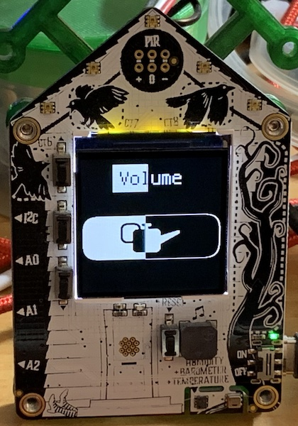

# text_progress_bar
An example of a class that can make a text or a bitmap into a progress bar.

The class takes a bitmap or an object with a bitmap property.  
It swaps the "full" and "empty" color indexes based on the value of progress (0-100).
- a palette allows selecting the "full" and "empty" colors based on the given colors.
  - it defaults to black and white colors.
  - the colors must in the palette.
- empty and full indexes default to 0 and 1.
- does not change the other colors.
- doesn't work with OnDiskBitmap since is changes the bitmap.
- it is advised to have the "empty" color be the background color of the image.

